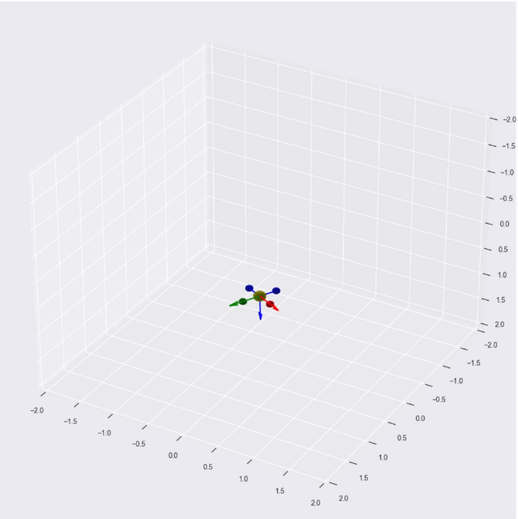

# Plotting 3D Objects with Matplotlib

A Python class for drawing a 3D objects using Python Matplotlib library.




The sole purpose of this library is to provide a few customizable 3D shapes so that you can conveneintly use them for generating 3D plots.

## How to Use

1. Add this as a submodule.
    ```sh
    cd /directory/where/you/have/your/python/files
    git submodule add https://github.com/kanishkegb/pyplot-3d.git ./pyplot3d
    ```
    Alternatively, you can download the repo as a zip file, extract it, rename it to `pyplot3d`, and move it your directory with python codes.

1. Use the library in your code.
    ```python
    from pyplot3d.uav import Uav
    from pyplot3d.utils import ypr_to_R

    import numpy as np
    import matplotlib.pyplot as plt

    plt.style.use('seaborn')

    # initialize plot
    fig = plt.figure()
    ax = fig.gca(projection='3d')
    
    arm_length = 0.24  # in meters
    uav = Uav(ax, arm_length)

    uav.draw_at([1, 0, 0], ypr_to_R([np.pi/2.0, 0, 0]))

    plt.show()
    ```
    
1. Run the code.
    ```sh
    python3 /name/of/your/file
    ```

You can combine multiple objects.
For example, the UAV plot is simply a combination of a few other basic shapes defined in `basic.py`.
Just make sure to call all the objects before calling `plt.show()`.


Also, you can use it with combination of animations package.
The below code can be used to generate the GIF shown above.

```python
import numpy as np
from matplotlib import pyplot as plt
# %matplotlib inline

from matplotlib import animation

from uav import pyplot3d.Uav
from utils import pyplot3d.ypr_to_R


def update_plot(i, x, R):
    uav_plot.update_plot(x[:, i], R[:, :, i])
    
    # These limits must be set manually since we use
    # a different axis frame configuration than the
    # one matplotlib uses.
    xmin, xmax = -2, 2
    ymin, ymax = -2, 2
    zmin, zmax = -2, 2
    
    ax.set_xlim([xmin, xmax])
    ax.set_ylim([ymax, ymin])
    ax.set_zlim([zmax, zmin])


plt.style.use('seaborn')

fig = plt.figure()
ax = fig.gca(projection='3d')

arm_length = 0.24  # in meters
uav_plot = Uav(ax, arm_length)


# Create some fake simulation data
steps = 60
t_end = 1

x = np.zeros((3, steps))
x[0, :] = np.arange(0, t_end, t_end / steps)
x[1, :] = np.arange(0, t_end, t_end / steps) * 2

R = np.zeros((3, 3, steps))
for i in range(steps):
    ypr = np.array([i, 0.1 * i, 0.0])
    R[:, :, i] = ypr_to_R(ypr, degrees=True)

ani = animation.FuncAnimation(fig, update_plot, frames=20, fargs=(x, R,));

# If using Jupyter Notebooks
# from IPython.display import HTML
# HTML(ani.to_jshtml())

